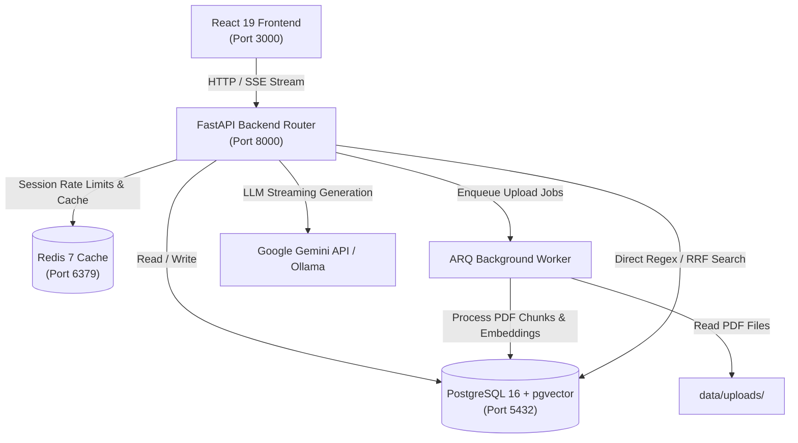

# Nyaya System Architecture & Technical Design

## 1. High-Level Service Architecture



---

## 2. Request Lifecycle Flows

### Flow (a): User Document Upload
1. **HTTP Post**: Client posts PDF file to `POST /api/v1/documents/upload` with header `X-Session-ID: <session_id>`.
2. **Validation & Security**: FastAPI router inspects PDF magic bytes (`%PDF-`), enforces 20MB file size limit, verifies PyMuPDF non-encryption status, and runs heuristic prompt injection scanning.
3. **Queue Enqueue**: API writes binary file to `data/uploads/<filename>` and enqueues job `process_document_job` onto Redis via `arq`. API immediately returns `202 Accepted` with `document_id`.
4. **Async Worker Processing**: ARQ worker picks up job, extracts text using PyMuPDF, chunks text using recursive character splitter (1000 chars, 200 overlap), computes 768-d BAAI/bge-base-en-v1.5 embeddings, and inserts rows into `user_document_chunk` with session scope.
5. **Status Polling**: Client polls `GET /api/v1/documents/<id>/status` until state transitions from `processing` to `ready`.

### Flow (b): Statute Legal Question
1. **HTTP SSE Request**: Client posts query to `POST /api/v1/chat` (e.g. `"What is section 35 BNSS?"`).
2. **Intent & Refusal Check**: Router evaluates `detect_act_and_section_intent()`. If query is non-statutory, router checks top dense cosine similarity score against threshold $0.68$. If $< 0.68$, router streams an instant refusal message without calling LLM.
3. **Retrieval Execution**:
   - *Direct Match*: Regex hits exact section match (`BNSS §35`), fetching ground-truth chunks deterministically with score 1.0.
   - *Hybrid Search*: Runs parallel `pgvector` cosine similarity search ($1 - \text{cosine\_distance}$) and in-memory BM25Okapi search over 1,262 statutory chunks. Fuses results using Reciprocal Rank Fusion ($k=60$).
4. **LLM Generation**: Top retrieved chunks are formatted into prompt context. Provider invokes Google Gemini API (`gemini-3.5-flash-lite`) via `google-genai` SDK with streaming enabled.
5. **Citation Guard & Streaming**: Generated text tokens stream to client via SSE. Upon stream completion, `citation_guard.py` verifies all `[BNSS s.X]` citations against retrieved context; any hallucinated citations are stripped before final `done` event.

### Flow (c): User Document Question
1. **Session Scope Detection**: Client posts query to `POST /api/v1/chat` with active session ID and document reference.
2. **Session Search**: Router executes vector similarity search against `user_document_chunk` filtering strictly by `session_id == active_session_id`.
3. **Context Formatting**: Retrieved document passages are formatted into prompt context with distinct citation format `[Doc: filename.pdf, p.X]`.
4. **LLM Synthesis**: Gemini LLM generates answer strictly grounded in uploaded case file context.
5. **Source Drawer Rendering**: Frontend parses document citations and displays exact document text snippets and page numbers in slide-over Source Drawer.

---

## 3. Statutory Chunk Schema (`StatuteChunk` Entity)

```json
{
  "chunk_id": "bnss-s35-001",
  "act": "Bharatiya Nagarik Suraksha Sanhita, 2023",
  "act_short": "BNSS",
  "chapter_number": 5,
  "chapter_title": "ARREST OF PERSONS",
  "section_number": "35",
  "section_title": "Section 35. When police may arrest without warrant",
  "clause_identifier": "(1)",
  "text": "35. (1) Any police officer may without an order from a Magistrate and without a warrant, arrest any person— (a) who commits, in the presence of a police officer, a cognizable offence...",
  "page_start": 13,
  "page_end": 14,
  "token_count": 342,
  "embedding": [-0.0214, 0.0481, "... 768 dimensions ..."],
  "metadata": {
    "provisos_attached": 2,
    "explanations_attached": 0,
    "cross_references": ["39", "40", "60"]
  }
}
```

---

## 4. Dual-Table Retrieval & Routing Logic

### Regex Direct Routing Matrix
| Query Pattern | Regex Match | Target Table | Retrieval Action |
| :--- | :--- | :--- | :--- |
| `"section 35 bnss"` | `r"(?:section\|sec\|\S)\s*(\d+[a-z]?)"` + `bnss` | `statute_chunk` | Direct SQL query `section_number = '35'` (Score 1.0) |
| `"bns section 65(1)"` | `r"bns\s+(?:section\|sec\|\S)\s*(\d+[a-z]?)"` | `offence_classification` | Direct SQL query `section_number = '65'` (Score 1.0) |
| `"section 103"` (Ambiguous) | `r"section\s*(\d+)"` | `statute_chunk` $\rightarrow$ `offence_classification` | Try BNSS `statute_chunk`; if 0 rows, fallback to BNS `offence_classification`. |

### Reciprocal Rank Fusion (RRF) Formula
For hybrid semantic queries, dense vector ranks ($R_{\text{dense}}$) and sparse BM25 ranks ($R_{\text{sparse}}$) are combined using RRF with constant $k=60$:

$$\text{RRF\_Score}(d) = \frac{1}{60 + R_{\text{dense}}(d)} + \frac{1}{60 + R_{\text{sparse}}(d)}$$

Top 5 fused chunks are passed to prompt context for LLM generation.
